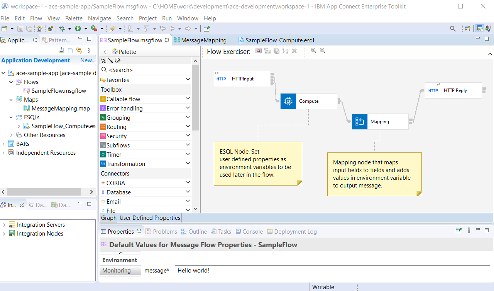
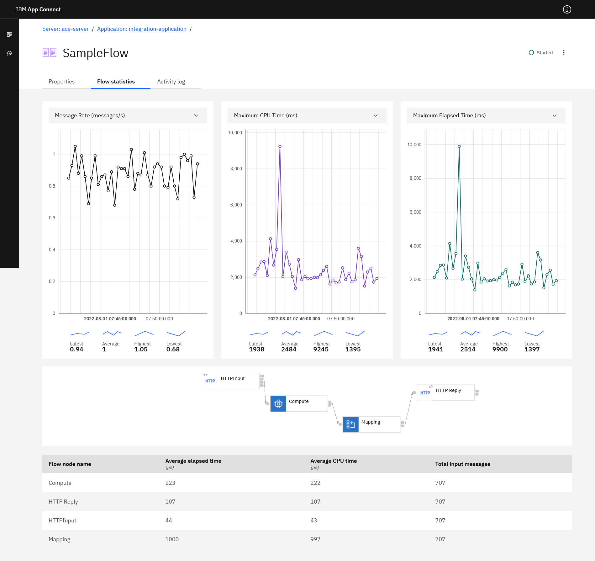

= IBM App Connect Enterprise - sample integration application
:toc: left
:toc-title: Table of Contents

This repository includes sample integration application built with https://www.ibm.com/docs/en/app-connect/12.0?topic=overview-app-connect-enterprise-toolkit[IBM App Connect Enterprise Toolkit] and Dockerfile(s) to run the integration application in a container.

== Purpose

The purpose of this repo, the integration application and Dockerfile is to provide an example how a single integration application is provided as container image and how to configure container using environment variables. 

Use this repo as an example how to create a container from your own ACE-project(s).

Note that this repo provides one example, but https://en.wikipedia.org/wiki/There%27s_more_than_one_way_to_do_it[there is more than one way to do it].


== Application

The application is a very simple integration with HTTP input interface that outputs JSON message or transforms input field to output field. The application is based on https://github.com/ot4i/http-input-tutorial[an existing sample].

Sample commands and output:

```
>curl http://localhost:7800
{"message":"Hello world!"}

>curl -d '{\"input1\":\"hello\",\"input2\":\"world\"}' http://localhost:7800/
{"output1":"hello","output2":"world","message":"Hello world!"}
```

== Development

The application and container in this repo are developed using the following assumptions:

* IBM App Connect Enterprise version is 12.x.
* IBM App Connect Enterprise is the developer edition.
* Integration application development is done using ACE toolkit in developer workstation.
* All development is done in developer workstation.
** Integration server for testing runs inside toolkit.
* All integration application artifacts are inside single project.
** Sample project is in link:ace-sample-app/[ace-sample-app]-directory.
* Developer does not build bar-files, nor deploys application to external server.
* Developer is responsible for writing the Dockerfile.
* Developer is responsible for application and ACE lifecycle, updating when required.
* Developer builds image and pushes it to registry.

.The sample application developed using IBM App Connect Enterprise Toolkit


== Container

There are three Dockerfiles in this repository:

* link:ace-base-image/Dockerfile[ace-base-image/Dockerfile] is the base image.
** Downloads and extracts ACE Developer edition (from http://public.dhe.ibm.com/ibmdl/export/pub/software/websphere/integration/).
*** Version is given in the Dockerfile
** Updates the Red Hat UBI base image.
* link:Dockerfile[Dockerfile] is the main image.
** Sets up ACE, adds application sources and other files.
** It is based on https://github.com/ot4i/ace-docker.
* link:Dockerfile-with-ace-install[Dockerfile-with-ace-install] combines the base and main image files.

The final entry in Dockerfile is CMD that calls the link:start.sh[start.sh]-script.

The link:start.sh[start.sh]-script does the following every time the container starts:

* Initializes ACE environment.
* Creates bar-file.
* Overrides properties in bar-file, if properties are given in _ACE_PROPERTY_OVERRIDES_ environment variable.
* Installs bar-file to integration server in the container.
* Starts the integration server.

See link:start.sh[start.sh] for more details.

== Usage

* Sample container is available from Dockerhub
** https://hub.docker.com/repository/docker/kazhar/ace-sample 
* Build container:
```
docker build -t acesample .
```
* Run container in foreground:
```
docker run -it --rm -p 7800:7800 -p 7600:7600 acesample
```
* The admin dashboard runs on port 7600. Do not expose that port if dashboard access is not needed.
* Access the integration application in the container.
** Use browser or curl:
```
curl http://localhost:7800
```
* Set environment variables during startup:
```
docker run -it --rm -p 7800:7800 -p 7600:7600 -e ACE_PROPERTY_OVERRIDES=SampleFlow#message="Hello there!" acesample
```
* Access admin dashboard:
** http://localhost:7600


.Flow statistics page in the admin dashboard

