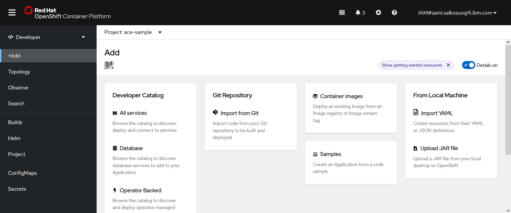
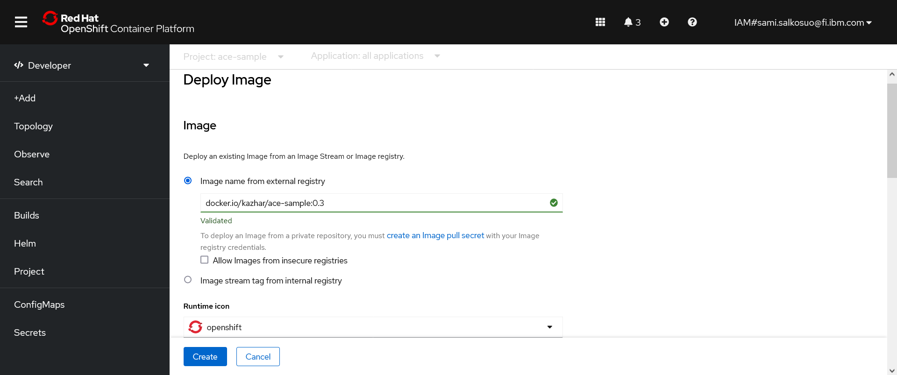
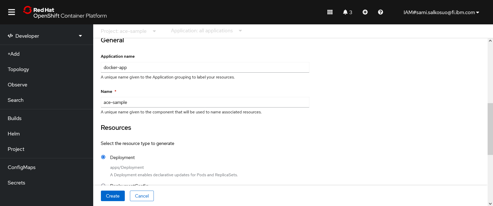
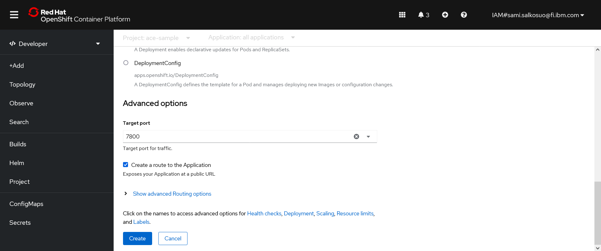

= OpenShift and ACE containers

ACE sample application container is can be installed to OpenShift-cluster using oc-client, YAML-files or OpenShift web console.

Before creating the application, login to OpenShift-cluster as developer (clusteradmin rights are not needed) and create new project using web console or oc-client:

```
oc new-project ace-sample
```

== oc-client

OpenShift can build images from sources in git-repository, such as this one, so ACE application can be installed using the following command:

```
oc new-app https://github.com/samisalkosuo/ace-sample
```

If the container is already built and it's available in a registry, specify the image in the command:

```
oc new-app --image=kazhar/ace-sample:0.3
```

By default, OpenShift takes name of the repository or image as application name. For example, _ace-sample_.
If you want to change the name, use _--name_-argument when creating the application:

```
oc new-app --image=kazhar/ace-sample:0.3 --name ace-app
```

Creating new application sets application name as value for _app_-label, for example: `app=my-ace-sample`. 

Environment variables are set by giving `-e` argument in the `new-app` command or after the installation modifying the deployment:

```
oc set env deployment/ace-sample ACE_APPNAME=great-app
```

By default, no routes are created when application is created, so create routes using:

```
#expose HTTP port using default name
oc expose --port=7800-tcp service/ace-sample

#expose admin and specify name for the route
oc expose --port=7600-tcp --name ace-admin service/ace-sample
```

The application is deleted using delete-command and specifying _app_-label:

```
oc delete all -l app=ace-sample
```

More details about creating applications is found from documentation: https://docs.openshift.com/container-platform/4.10/applications/creating_applications/creating-applications-using-cli.html.

== YAMLs

YAML-files can be used to create application resources.

* link:configmap.yaml[configmap.yaml] - creates ConfigMap with configuration. Values for environment variables are defined in ConfigMap.
* link:deployment.yaml[deployment.yaml] - creates Deployment, and pods, from existing image.
* link:route.yaml[route.yaml] - creates Routes for HTTP endpoint and HTTPS admin dashboard. Routes are used to access endpoints from outside OpenShift.
* link:secret.yaml[secret.yaml] - creates Secret with configuration. Values for environment variables are defined in Secret.
* link:service.yaml[service.yaml] - creates Service to access ACE application inside OpenShift.

Use following commands to create, or update, application resources:

```
oc apply -f configmap.yaml
oc apply -f deployment.yaml
oc apply -f route.yaml
oc apply -f secret.yaml
oc apply -f service.yaml

#or
ls -1 *yaml |awk '{print "oc apply -f " $1}' |sh
```

To delete resources, use following commands:

```
oc delete -f configmap.yaml
oc delete -f deployment.yaml
oc delete -f route.yaml
oc delete -f secret.yaml
oc delete -f service.yaml

#or
ls -1 *yaml |awk '{print "oc delete -f " $1}' |sh
```

== OpenShift web console

OpenShift web console has a developer-view and there is easy way to create a new application. Screenshots below shows web console UI to add new applications.

.Add new application - OpenShift web console developer view


.Deploy image UI - part 1


.Deploy image UI - part 2


.Deploy image UI - part 3

